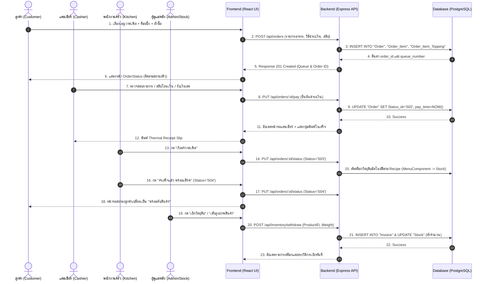
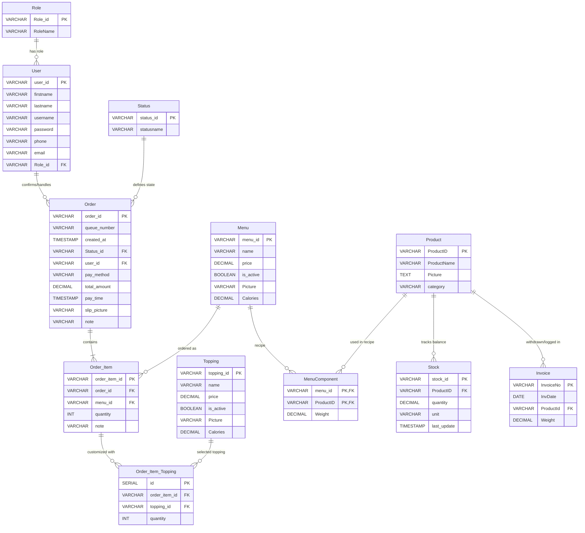

# 📖 เอกสารการไหลของข้อมูลระบบ POS ร้านตี๋อบ วาฟเฟิล ฮ่องกง (End-to-End Data Flow Architecture)

เอกสารฉบับนี้อธิบายถึง **การไหลของข้อมูล (Data Flow)** และ **สถาปัตยกรรมระบบ (System Architecture)** ทั้งหมด ตั้งแต่หน้าบ้าน (Frontend) ผ่านเครือข่าย API ไปยังหลังบ้าน (Backend) และฐานข้อมูล (PostgreSQL) อย่างละเอียดครบถ้วนทุกโมดูล

---

## 📑 สารบัญ
1. [ภาพรวมสถาปัตยกรรมระบบ (System Architecture Overview)](#1-ภาพรวมสถาปัตยกรรมระบบ-system-architecture-overview)
2. [แผนภาพรวมการไหลของข้อมูล (System Data Flow Diagram)](#2-แผนภาพรวมการไหลของข้อมูล-system-data-flow-diagram)
3. [การไหลของข้อมูลรายโมดูลอย่างละเอียด (Detailed Data Flow by Modules)](#3-การไหลของข้อมูลรายโมดูลอย่างละเอียด-detailed-data-flow-by-modules)
   - [3.1 ฝั่งลูกค้า (Customer Ordering & Tracking Flow)](#31-ฝั่งลูกค้า-customer-ordering--tracking-flow)
   - [3.2 ฝั่งแคชเชียร์และจุดชำระเงิน (Cashier POS & Payment Flow)](#32-ฝั่งแคชเชียร์และจุดชำระเงิน-cashier-pos--payment-flow)
   - [3.3 ฝั่งครัว / KDS (Kitchen Display System Flow)](#33-ฝั่งครัว--kds-kitchen-display-system-flow)
   - [3.4 ฝั่งคลังสต็อกและเบิกวัตถุดิบ (Inventory & Material Flow)](#34-ฝั่งคลังสต็อกและเบิกวัตถุดิบ-inventory--material-flow)
   - [3.5 ฝั่งผู้บริหารและแดชบอร์ด (Admin Dashboard & Analytics Flow)](#35-ฝั่งผู้บริหารและแดชบอร์ด-admin-dashboard--analytics-flow)
4. [โครงสร้างและความสัมพันธ์ของฐานข้อมูล (Database ER Diagram)](#4-โครงสร้างและความสัมพันธ์ของฐานข้อมูล-database-er-diagram)
5. [ตารางสรุป RESTful API Endpoints ทั้งหมด](#5-ตารางสรุป-restful-api-endpoints-ทั้งหมด)
6. [วงจรชีวิตของคำสั่งซื้อ (Order State Lifecycle Matrix)](#6-วงจรชีวิตของคำสั่งซื้อ-order-state-lifecycle-matrix)

---

## 1. ภาพรวมสถาปัตยกรรมระบบ (System Architecture Overview)

ระบบถูกออกแบบด้วยสถาปัตยกรรมแบบ **Client-Server (Decoupled Frontend & Backend REST API)**:

```
+-------------------------------------------------------------------------+
|                          1. CLIENT (FRONTEND)                           |
|  React (Vite) + React Router + CSS Design System + Context & LocalState |
|  - Customer Kiosk/Mobile Web  - Cashier POS                             |
|  - Kitchen Display (KDS)      - Inventory & Admin Dashboard             |
+-------------------------------------------------------------------------+
                                    │
                                    │  HTTP / JSON / Base64 File Payload
                                    │  (REST API Endpoints)
                                    ▼
+-------------------------------------------------------------------------+
|                          2. SERVER (BACKEND)                            |
|  Node.js + Express.js                                                   |
|  - Routes: /api/menus, /api/orders, /api/inventory, /api/dashboard...   |
|  - Controllers: Order Logic, Inventory Deduction, Invoice Logging       |
|  - Static File Server: /images (จัดเก็บรูปภาพเมนู, สลิป, สินค้าสต็อก)    |
+-------------------------------------------------------------------------+
                                    │
                                    │  SQL Queries (pg Pool Connection)
                                    ▼
+-------------------------------------------------------------------------+
|                        3. DATABASE (POSTGRESQL)                         |
|  Relational Database                                                    |
|  - Tables: Order, Order_Item, Order_Item_Topping, Menu, Topping         |
|  - Tables: Product, Stock, Invoice, MenuComponent, User, Role, Status   |
+-------------------------------------------------------------------------+
```

---

## 2. แผนภาพรวมการไหลของข้อมูล (System Data Flow Diagram)



---

## 3. การไหลของข้อมูลรายโมดูลอย่างละเอียด (Detailed Data Flow by Modules)

---

### 3.1 ฝั่งลูกค้า (Customer Ordering & Tracking Flow)

```
[Home.jsx] ─── (เลือกเมนู) ───► [ProductDetail.jsx] ─── (เลือกท็อปปิ้ง) ───► [Cart.jsx] ───► [Checkout.jsx]
                                                                                                    │
                                                                                        (POST /api/orders)
                                                                                                    ▼
                                                                                            [OrderStatus.jsx]
                                                                                          (Polling ทุก 5 วินาที)
```

#### ขั้นตอนการทำงาน:
1. **ดึงข้อมูลเมนูและท็อปปิ้ง (`Home.jsx` / `ProductDetail.jsx`):**
   - Frontend ยิง `GET /api/menus` และ `GET /api/menus/toppings`
   - Backend คิวรีตาราง `"Menu"` และ `"Topping"` เฉพาะที่มี `is_active = TRUE`
   - ส่ง JSON Array กลับมาแสดงเป็นการ์ดวาฟเฟิลพร้อมรูปภาพ, แคลอรี่ และราคา
2. **ปรับแต่งวาฟเฟิลและใส่ตะกร้า (`ProductDetail.jsx`):**
   - ลูกค้าสามารถเลือกจำนวนไส้/ท็อปปิ้ง และระบุหมายเหตุพิเศษ (เช่น หวานน้อย, กรอบๆ)
   - State ใน Frontend คำนวณราคารวม (Base Price + Toppings Price) และแคลอรี่รวม
   - บันทึกลงใน React State `cart`
3. **การชำระเงินและส่งคำสั่งซื้อ (`Checkout.jsx`):**
   - **กรณีเลือกเงินสด (Cash):** `pay_method = 'cash'` -> สถานะเริ่มต้นคือ `S01` (รอชำระเงินที่เคาน์เตอร์)
   - **กรณีเลือกโอนเงิน (PromptPay):** ลูกค้าสแกน QR Code แล้วอัปโหลดสลิป
     - รูปสลิปถูกแปลงเป็น Base64 String ส่งผ่าน Payload
     - Backend นำ Base64 ไปถอดรหัสและบันทึกเป็นไฟล์ `.png` ลงที่ `backend/public/images/`
     - ตั้งชื่อไฟล์ตามเลขออเดอร์ เช่น `ORD-00020_slip.png`
     - ตั้งสถานะเริ่มต้นเป็น `S02` (รอดำเนินการ/รอตรวจสอบ)
4. **การบันทึกลงฐานข้อมูล (`orderController.js -> createOrder`):**
   - สร้างรหัสออเดอร์อัตโนมัติ เช่น `ORD-00021` และรหัสคิว เช่น `A01` หรือ `E001`
   - Insert ลงตาราง `"Order"`
   - วนลูป Insert แต่ละรายการลงตาราง `"Order_Item"`
   - วนลูป Insert ท็อปปิ้งของแต่ละรายการลงตาราง `"Order_Item_Topping"`
5. **การติดตามสถานะออเดอร์ (`OrderStatus.jsx`):**
   - ทำ **Auto-Polling** ยิง `GET /api/orders/:id` ทุกๆ 5 วินาที
   - แสดง Progress Step Bar: `รอชำระเงิน` ➔ `รอดำเนินการ` ➔ `กำลังอบวาฟเฟิล` ➔ `พร้อมรับสินค้า` ➔ `เสร็จสิ้น`

---

### 3.2 ฝั่งแคชเชียร์และจุดชำระเงิน (Cashier POS & Payment Flow)

```
[CashierDashboard.jsx] ─── (ดูออเดอร์สด) ───► [ตรวจสอบยอด/สลิป] ───► [กดยืนยันชำระเงิน] ───► [ReceiptSlip.jsx]
                                                                     (PUT /api/orders/:id/pay)     (Thermal Print)
```

#### ขั้นตอนการทำงาน:
1. **กระดานออเดอร์แคชเชียร์ (`CashierDashboard.jsx` / `CashierOrders.jsx`):**
   - ยิง `GET /api/orders` เพื่อดึงออเดอร์ทั้งหมดในวันปัจจุบัน
   - แบ่งหมวดหมู่ออเดอร์: `รอชำระเงิน`, `กำลังดำเนินการ`, `ประวัติที่เสร็จสิ้น`
2. **การยืนยันการรับเงิน / ตรวจสอบสลิป:**
   - แคชเชียร์คลิกดูรูปสลิปที่ลูกค้าแนบมา (เปิด Modal ดูภาพขยาย)
   - กดปุ่ม **"ยืนยันการชำระเงิน"** (`PUT /api/orders/:id/pay`)
   - Backend จะ:
     - อัปเดต `Status_id = 'S02'` (รอดำเนินการ)
     - อัปเดต `pay_time = CURRENT_TIMESTAMP`
     - บันทึก `user_id` ของแคชเชียร์ที่กดยืนยัน
3. **การออกใบเสร็จรับเงิน (Receipt Slip Generation):**
   - หลังชำระเงินสำเร็จ Modal ใบเสร็จ (`ReceiptSlip.jsx`) จะเด้งขึ้นมาอัตโนมัติ
   - แสดงหัวบิล: ร้านตี๋อบ วาฟเฟิล ฮ่องกง, หมายเลขคิวเด่นชัด, วันที่-เวลา, ชื่อแคชเชียร์
   - รายการสินค้าพร้อมท็อปปิ้ง และยอดสุทธิ (ไม่มี VAT 7%)
   - รองรับการกด **"พิมพ์สลิป"** เชื่อมต่อเครื่องพิมพ์ความร้อน (Thermal POS Printer ขนาด 80mm/58mm) ผ่าน `window.print()`

---

### 3.3 ฝั่งครัว / KDS (Kitchen Display System Flow)

```
[KitchenKDS.jsx] ─── (ดึงเฉพาะ S02, S03, S04) ───► [กดเริ่มทำ (S03)] ───► [ตัดสต็อกวัตถุดิบอัตโนมัติ]
                                                            │
                                                            ▼
                                                   [กดเสร็จสิ้น (S04)]
```

#### ขั้นตอนการทำงาน:
1. **หน้าจอครัว (`KitchenKDS.jsx`):**
   - ดึงเฉพาะรายการที่ชำระเงินเรียบร้อยแล้ว (`Status_id IN ('S02', 'S03', 'S04')`)
   - แสดงการ์ดออเดอร์พร้อมเวลาที่รอ (Timer) และรายละเอียดท็อปปิ้ง/หมายเหตุพิเศษอย่างชัดเจน
2. **กด "เริ่มทำ" (`Status = S03 - กำลังปรุง`):**
   - ส่ง `PUT /api/orders/:id/status` พร้อม `status_id = 'S03'`
   - **ระบบตัดสต็อกสูตรอาหารอัตโนมัติ:**
     - Backend ค้นหาจากตาราง `"MenuComponent"` ว่าเมนูนี้ใช้วัตถุดิบ `"ProductID"` ใดบ้าง และน้ำหนัก `"Weight"` เท่าใด
     - นำไปคูณกับจำนวนชิ้น `quantity` ในออเดอร์
     - ทำการ `UPDATE "Stock" SET quantity = quantity - $used WHERE "ProductID" = $pid` ทันที
3. **กด "พร้อมรับ" (`Status = S04 - พร้อมรับ`):**
   - ส่งเสียงแจ้งเตือน หรือเปลี่ยนสถานะบนหน้าจอเรียกลูกค้า

---

### 3.4 ฝั่งคลังสต็อกและเบิกวัตถุดิบ (Inventory & Material Flow)

```
[InventoryManagement.jsx]
   ├── [ดูสต็อก & แจ้งเตือน ระวัง/หมด] ───► (GET /api/inventory)
   ├── [เติมสต็อก (+)] ──────────────────► (POST /api/inventory/restock) ──► UPDATE "Stock"
   ├── [เบิกวัตถุดิบ (🛒)] ───────────────► (POST /api/inventory/withdraw) ──► INSERT "Invoice" & UPDATE "Stock"
   ├── [ดูประวัติการเบิก] ────────────────► (GET /api/inventory/invoices) ──► SELECT FROM "Invoice"
   └── [เพิ่ม/แก้ไขสินค้า & รูปภาพ] ───────► (POST/PUT /api/inventory/products) ──► Save File & UPDATE "Product"
```

#### ขั้นตอนการทำงาน:
1. **การตรวจสอบสต็อกสินค้า (`GET /api/inventory`):**
   - Backend ทำการ `JOIN` ตาราง `"Product"` และ `"Stock"`
   - คำนวณสถานะ:
     - `quantity <= 0` ➔ **สินค้าหมด** (Out of Stock - สีแดง)
     - `quantity <= 10` ➔ **ระวัง** (Low Stock - สีส้ม)
     - `quantity > 10` ➔ **ปกติ** (Normal - สีเขียว)
2. **การเติมสต็อกสินค้า (`POST /api/inventory/restock`):**
   - Payload: `{ ProductID: 'P01', amount: 50, mode: 'add' | 'set' }`
   - โหมด `add`: `UPDATE "Stock" SET quantity = quantity + $amount, last_update = NOW()`
   - โหมด `set`: `UPDATE "Stock" SET quantity = $amount, last_update = NOW()`
3. **การเบิกวัตถุดิบ (`POST /api/inventory/withdraw`):**
   - Payload: `{ ProductId: 'P01', Weight: 10, InvDate: '2026-08-09' }`
   - Backend จะ:
     1. สร้างเลขที่ใบเบิกอัตโนมัติ เช่น `INV-0001`, `INV-0002`
     2. `INSERT INTO "Invoice" ("InvoiceNo", "InvDate", "ProductId", "Weight") VALUES (...)`
     3. `UPDATE "Stock" SET quantity = quantity - $weight WHERE "ProductID" = $pid`
4. **การจัดการรูปภาพสินค้า (Image Upload & Storage):**
   - รับไฟล์รูปจาก Frontend เป็น Base64 String
   - บันทึกไฟล์ลงที่ `backend/public/images/prod_<timestamp>.png`
   - บันทึกชื่อไฟล์ลงในฟิลด์ `"Picture"` ในตาราง `"Product"`
   - ให้บริการรูปภาพผ่าน Express Static Route `http://localhost:5000/images/<filename>`

---

### 3.5 ฝั่งผู้บริหารและแดชบอร์ด (Admin Dashboard & Analytics Flow)

```
[AdminDashboard.jsx] ─── (GET /api/dashboard/summary) ───► ยอดขายรวม, จำนวนออเดอร์, สินค้ายอดนิยม
                     ─── (GET /api/dashboard/sales-trend) ──► กราฟยอดขายรายวัน/รายเดือน
                     ─── (GET/POST /api/users) ──────────► จัดการบัญชีพนักงาน (Admin, Cashier, Kitchen)
```

---

## 4. โครงสร้างและความสัมพันธ์ของฐานข้อมูล (Database ER Diagram)



---

## 5. ตารางสรุป RESTful API Endpoints ทั้งหมด

| หมวดหมู่ | Method | Endpoint | Request Body ตัวอย่าง | คำอธิบายการทำงาน |
| :--- | :---: | :--- | :--- | :--- |
| **Menus** | `GET` | `/api/menus` | - | ดึงรายการเมนูวาฟเฟิลทั้งหมดที่เปิดขาย |
| **Menus** | `GET` | `/api/menus/toppings`| - | ดึงรายการไส้/ท็อปปิ้งทั้งหมด |
| **Orders**| `POST`| `/api/orders` | `{ pay_method, total_amount, slip_picture, items: [...] }` | สร้างออเดอร์ใหม่ พร้อมบันทึกรายการสินค้าและท็อปปิ้ง |
| **Orders**| `GET` | `/api/orders` | Query: `?status=...&date=...` | ดึงรายการออเดอร์ทั้งหมดสำหรับแคชเชียร์/ครัว |
| **Orders**| `GET` | `/api/orders/:id` | - | ดึงข้อมูลและสถานะของออเดอร์รายบุคคล |
| **Orders**| `PUT` | `/api/orders/:id/pay`| `{ user_id: "U02" }` | ยืนยันการชำระเงิน บันทึกเวลาชำระ และเปลี่ยนสถานะเป็น S02 |
| **Orders**| `PUT` | `/api/orders/:id/status`| `{ status_id: "S03" }` | อัปเดตสถานะการปรุง/พร้อมเสิร์ฟ (ตัดสต็อกเมื่อเริ่มปรุง) |
| **Stock** | `GET` | `/api/inventory` | - | ดึงข้อมูลสต็อกสินค้าคงเหลือและระดับความปลอดภัย |
| **Stock** | `POST`| `/api/inventory/restock`| `{ ProductID: "P01", amount: 20, mode: "add" }` | เติมสต็อกสินค้า หรือตั้งค่าจำนวนใหม่ |
| **Stock** | `POST`| `/api/inventory/withdraw`| `{ ProductId: "P01", Weight: 5, InvDate: "2026-08-09" }` | บันทึกการเบิกวัตถุดิบลง Invoice และหักลบ Stock |
| **Stock** | `GET` | `/api/inventory/invoices`| - | ดึงประวัติรายการเบิกวัตถุดิบย้อนหลังทั้งหมด |
| **Stock** | `POST`| `/api/inventory/products`| `{ ProductName, quantity, unit, category, Picture }` | เพิ่มสินค้าใหม่ในคลังพร้อมอัปโหลดรูปภาพ |
| **Stock** | `PUT` | `/api/inventory/products/:id`| `{ ProductName, category, Picture }` | แก้ไขข้อมูลสินค้าและเปลี่ยนรูปภาพ |
| **Stock** | `DELETE`| `/api/inventory/products/:id`| - | ลบสินค้าออกจากระบบ (ลบ Stock ก่อนลบ Product) |
| **Dashboard**| `GET`| `/api/dashboard/summary`| - | ดึงสถิติภาพรวมรายได้ ยอดขาย ออเดอร์ |
| **Dashboard**| `GET`| `/api/dashboard/sales-trend`| - | ดึงข้อมูลแนวโน้มยอดขายสำหรับทำกราฟ |
| **Users** | `POST`| `/api/users/login` | `{ username, password }` | เข้าสู่ระบบตรวจสอบสิทธิ์ (Admin / Cashier / Kitchen) |
| **Users** | `GET` | `/api/users` | - | ดึงรายชื่อพนักงานทั้งหมด |

---

## 6. วงจรชีวิตของคำสั่งซื้อ (Order State Lifecycle Matrix)

```
[สร้างออเดอร์ใหม่]
       │
       ▼
   (วิธีชำระ?)
   ├── เงินสด ─────────► [S01: รอชำระเงิน] ────(แคชเชียร์รับเงิน)────┐
   └── โอนเงิน/สลิป ────► [S02: รอดำเนินการ] ◄──────────────────────┘
                               │
                      (ครัวกด "เริ่มปรุง") ──► [ตัดสต็อกตามสูตร MenuComponent]
                               │
                               ▼
                        [S03: กำลังปรุง]
                               │
                      (ครัวกด "อบเสร็จแล้ว")
                               │
                               ▼
                        [S04: พร้อมรับ]
                               │
                      (ลูกค้ารับสินค้า)
                               │
                               ▼
                        [S05: เสร็จสิ้น]
```

---
*เอกสารนี้จัดทำขึ้นสำหรับการพัฒนาและบำรุงรักษาระบบ POS ร้านตี๋อบ วาฟเฟิล ฮ่องกง*
